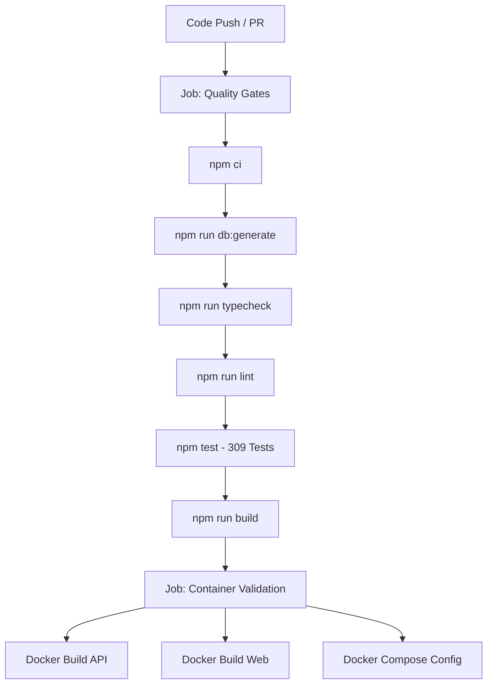

# CI/CD Pipeline & Deployment Automation

This document outlines the Continuous Integration (CI) and Continuous Deployment (CD) workflows for the **BIS Intelligent Platform**.

---

## 1. CI Pipeline (`.github/workflows/ci.yml`)

The CI pipeline runs automatically on:
- Every push to `main` and `develop`
- Every pull request targeting `main` and `develop`

### Workflow Structure



### Quality Gate Requirements
All checks in the quality gate must pass with zero errors:
1. **Typecheck**: Validates strict TypeScript compilation across `@bis/api`, `@bis/web`, and `@bis/shared`.
2. **Lint**: ESLint validation across all codebases.
3. **Tests**: All 309 unit, integration, and security tests must pass without skips or reductions.
4. **Build**: Production compilation of backend TypeScript and Vite frontend bundling.
5. **Docker Build Validation**: Ensures both Dockerfiles build without syntax or dependency failures.

---

## 2. Deployment Pipeline (`.github/workflows/deploy.yml`)

The deployment workflow is configured with **manual dispatch only (`workflow_dispatch`)** to ensure controlled rollouts.

### Deployment Safety Controls
1. **Manual Approval & Confirmation**:
   - The operator must explicitly select the target environment (`staging` or `production`).
   - The operator must type `CONFIRM` into the input prompt to prevent accidental triggers.
2. **Dedicated Environments**:
   - GitHub Environments (`staging` and `production`) isolate secrets and require approval rules before environment secrets are accessed.
3. **Automated Deployment Disabled**:
   - Until Phase 15C cloud provisioning is finalized, automatic deployments are prevented.

---

## 3. Database Migration Protocol

### Strict Production Rules
```
┌────────────────────────────────────────────────────────┐
│             CRITICAL PRODUCTION SAFETY RULE            │
├────────────────────────────────────────────────────────┤
│  ALLOWED:     npx prisma migrate deploy                │
│  FORBIDDEN:   npx prisma migrate reset                 │
│  FORBIDDEN:   npx prisma db push --force-reset         │
└────────────────────────────────────────────────────────┘
```

- **Execution Command**:
  ```bash
  npx prisma migrate deploy --schema=apps/api/prisma/schema.prisma
  ```
- **Idempotence**: `migrate deploy` executes only unapplied migrations and exits safely if all migrations are already in place.
- **Rollback Consideration**: If a migration fails or introduces an issue, rollbacks must be handled through forward-fixing migrations (`add_column`, `drop_column`, or data adjustments), as PostgreSQL does not support automatic down-migrations in Prisma.

---

## 4. Secret Management Strategy

Secrets are stored strictly in **GitHub Repository/Environment Secrets** and are injected at runtime into the container environments:

| Secret Name | Scope | Description |
|---|---|---|
| `DATABASE_URL` | Environment | Encrypted PostgreSQL connection string |
| `JWT_SECRET` | Environment | 64+ char cryptographic secret |
| `STORAGE_ACCESS_KEY_ID` | Environment | S3-compatible service IAM access key |
| `STORAGE_SECRET_ACCESS_KEY` | Environment | S3-compatible secret access key |
| `OPENAI_API_KEY` | Environment | OpenAI API key (if `AI_PROVIDER=openai`) |
| `GEMINI_API_KEY` | Environment | Gemini API key (if `AI_PROVIDER=gemini`) |

> **Security Note:** Secrets are NEVER baked into Docker images, committed to Git repositories, or exposed to the Vite frontend bundle.

---

## 5. Rollback Considerations

1. **Application Rollback**:
   - Re-deploy the previously known good container image tag (e.g. `bis-api:<previous-commit-sha>`).
   - Container deployments are stateless and rollback immediately upon restarting the container service with the previous image.
2. **Database Rollback**:
   - Automated point-in-time recovery (PITR) is maintained by the managed PostgreSQL service.
   - For minor schema rollbacks, apply an inverse migration using `prisma migrate deploy`.
