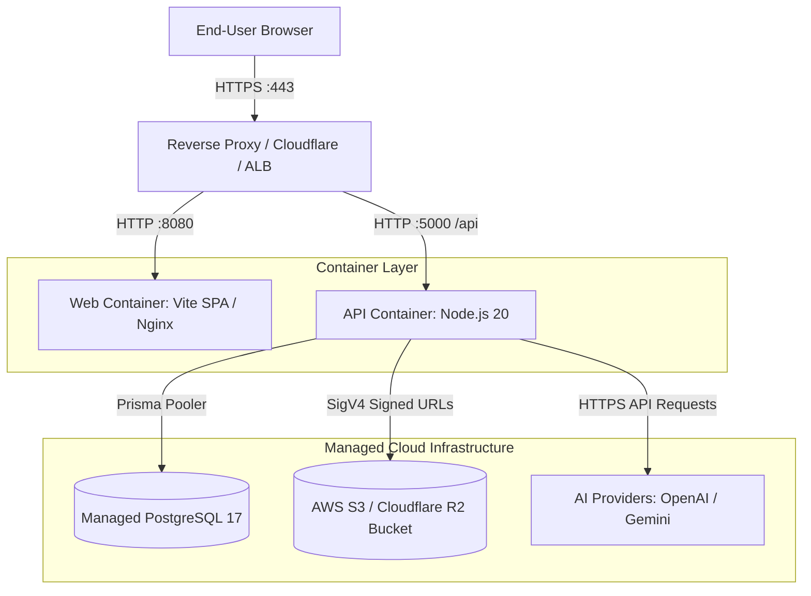

# Production Deployment Runbook

This guide provides operational procedures for deploying, maintaining, and verifying the **BIS Intelligent Platform** in production environments.

---

## 1. Production Architecture Overview

The production architecture is designed for high availability, zero-secret-leakage, and containerized micro-service execution:



---

## 2. Pre-Deployment Checklist

Before commencing a production rollout, ensure:
1. **Managed PostgreSQL 17** is provisioned with automated backups (PITR) enabled.
2. **Private S3 / R2 Bucket** is created with Block All Public Access enabled.
3. **IAM User / Access Keys** have scoped read/write/delete permissions strictly on the documents bucket.
4. **Environment Secrets** have been populated into the hosting provider's Secret Manager (or `.env.production`).
5. **DNS & SSL/TLS Certificates** are configured at the edge load balancer.

---

## 3. Required Production Environment Variables

See [`.env.production.example`](../.env.production.example) for exact formatting.

| Variable | Requirement | Description |
|---|---|---|
| `NODE_ENV` | `production` | Enables production error masking, JSON logging, and strict validation |
| `PORT` | `5000` | Port for the backend API |
| `DATABASE_URL` | `postgresql://...` | Connection string to PostgreSQL 17 instance with SSL enabled |
| `JWT_SECRET` | `string (>= 32 chars)` | Cryptographically strong secret (must NOT use dev default) |
| `CORS_ORIGIN` | `https://your-domain.gov.in` | Explicit frontend domain (never `*` in production) |
| `STORAGE_PROVIDER` | `s3` | S3-compatible cloud document storage |
| `STORAGE_BUCKET` | `string` | Name of the private S3/R2 bucket |
| `STORAGE_REGION` | `string` | AWS region (e.g. `ap-south-1` for Mumbai) |
| `STORAGE_ACCESS_KEY_ID` | `string` | AWS/Cloudflare IAM Access Key |
| `STORAGE_SECRET_ACCESS_KEY` | `string` | AWS/Cloudflare Secret Key |
| `AI_PROVIDER` | `mock` \| `openai` \| `gemini` | Chosen AI embedding & inference engine |
| `OPENAI_API_KEY` | `string` | Required if `AI_PROVIDER=openai` |
| `GEMINI_API_KEY` | `string` | Required if `AI_PROVIDER=gemini` |

---

## 4. Step-by-Step Deployment Procedure

### Step 1: Database Migration
Deploy database migrations before releasing new application code:

```bash
# Execute idempotent migration deployment
npx prisma migrate deploy --schema=apps/api/prisma/schema.prisma

# Verify migration status
npx prisma migrate status --schema=apps/api/prisma/schema.prisma
```

> **Warning:** NEVER execute `npx prisma migrate reset` or `npx prisma db push --force-reset` on a production database.

### Step 2: Seed Static System Metadata (First-Time Only)
If deploying to a fresh database, run the idempotent seed script:

```bash
npm run db:seed
```
This inserts baseline BIS standards, QCO orders, laboratories, schemes, and the system administrator account.

### Step 3: Build & Start Containers
Launch the containerized application stack using `docker-compose.prod.yml`:

```bash
# Pull or build container images
docker compose -f docker-compose.prod.yml --env-file .env.production build

# Start services in detached mode
docker compose -f docker-compose.prod.yml --env-file .env.production up -d
```

### Step 4: Verify Health & Readiness

Execute probes against the running services:

```bash
# Verify API Liveness
curl -f http://localhost:5000/api/v1/health/live

# Verify API Readiness (Confirms DB connectivity without exposing secrets)
curl -f http://localhost:5000/api/v1/health/ready

# Verify Web Nginx Server
curl -f http://localhost:8080/healthz
```

---

## 5. Security & Isolation Controls

1. **Non-Root Containers**: Processes inside containers run under unprivileged service accounts (`node:node` UID 1000, `nginx:nginx` UID 101).
2. **Read-Only Root Filesystem**: The root filesystem is mounted as read-only. Writable operations are restricted to in-memory `tmpfs` mounts.
3. **No Capabilities**: All Linux kernel capabilities are dropped (`cap_drop: [ALL]`).
4. **Error Sanitization**: In production, stack traces are stripped from API error envelopes, and sensitive connection strings or tokens are redacted from logs.
5. **No Secret Ingestion in Web Assets**: Static web assets only bundle public UI configuration (`VITE_API_URL`). Server secrets are strictly quarantined in backend containers.

---

## 6. Disaster Recovery & Rollback Procedure

### Application Service Rollback
If an application container fails post-deployment:
1. Revert to the prior image tag in the deployment configuration:
   ```bash
   docker compose -f docker-compose.prod.yml down
   # Point image tags in docker-compose.prod.yml to previous release tag
   docker compose -f docker-compose.prod.yml up -d
   ```
2. Verify liveness via `/api/v1/health/live`.

### Database Rollback
1. Minor schema adjustments: Apply a forward-correcting migration using `prisma migrate deploy`.
2. Catastrophic data corruption: Restore database snapshot from managed PostgreSQL PITR (Point-in-Time Recovery) backup window.
